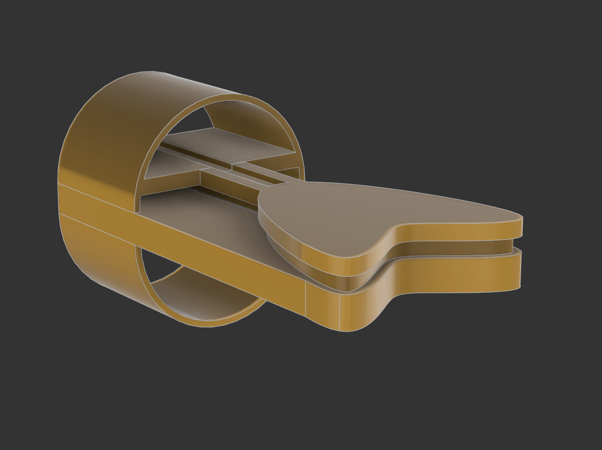

[← Back to Portfolio](./)

# Eddy Current Testing (ECT) Probe Design

*Figure 1: 3D Render of the custom coil probe assembly designed in Fusion 360.*

## 🎯 Objective
To design, fabricate, and test a custom Eddy Current Testing (ECT) probe capable of detecting surface flaws in conductive materials. The goal was to demonstrate the principles of electromagnetic induction and signal impedance analysis.

## ⚙️ Technical Details
* **Simulation:** FEMM (Finite Element Method Magnetics) for magnetic flux visualization.
* **Design:** Autodesk Fusion 360 (Probe Casing), Circuit Design (Wheatstone Bridge).
* **Analysis:** MATLAB (Signal Processing & Impedance Plotting).
* **Hardware:** Copper Coil (AWG 30), Ferrite Core, Oscilloscope, Function Generator.

## 🧠 The Challenge
Commercial ECT probes are expensive and "black box" systems. The challenge was to build a low-cost, functional probe from scratch that could distinguish between a **crack** (defect) and **liftoff** (distance from the surface), which is a common source of noise in NDT.

## 🔬 Methodology
1.  **Coil Design:** Calculated the optimal number of turns and wire gauge to achieve the target inductance for the operating frequency (10 kHz - 100 kHz).
2.  **Circuitry:** Implemented a **Wheatstone Bridge** circuit to null the probe and maximize sensitivity to impedance changes.
3.  **Simulation:** Used **FEMM** to simulate the magnetic field density and predict how the eddy currents would interact with a theoretical crack.
4.  **Testing:** Created calibration blocks with artificial defects (slits of varying depth) to verify the probe's sensitivity.

## 📊 Results & Analysis
The custom probe successfully identified surface defects on an aluminum test block.

* **Liftoff Effect:** Mapped the impedance plane curve, showing a clear phase separation between "liftoff" signals and "defect" signals.
* **Edge Effect:** Characterized the signal distortion near the edges of the workpiece, establishing a "dead zone" limit for the probe.

### Visuals

*Figure 2: MATLAB plot showing the impedance plane trajectory for different defect depths.*

---

### 📥 Downloads
[**📄 Download Full Project Report (PDF)**](project_pdfs/Eddy_Current_Testing_Probe_Design.pdf)
