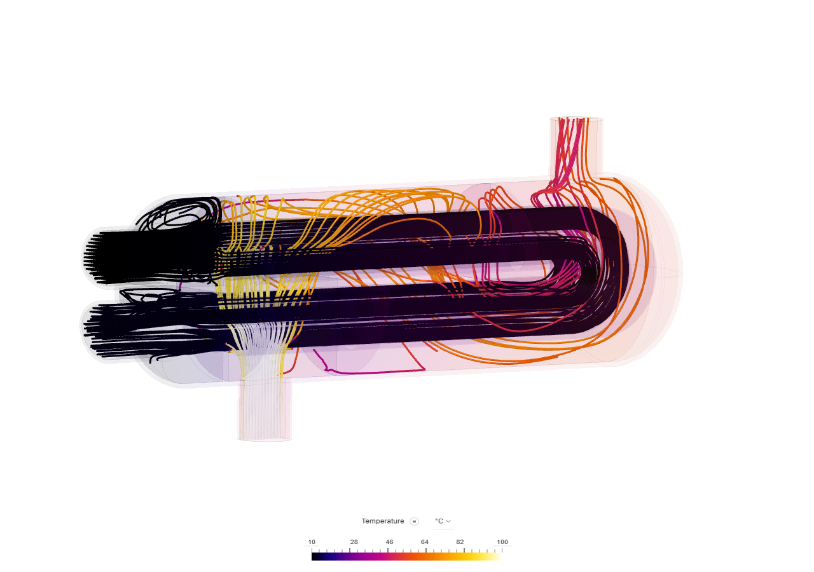

[← Back to Portfolio](./)

# Conjugate Heat Transfer Analysis of a Heat Exchanger

*Figure 1: Velocity streamlines showing fluid flow through the exchanger.*

## 🎯 Objective
To analyze the fluid domain of a heat exchanger and optimize design parameters to maximize heat transfer efficiency while minimizing pressure drop.

## ⚙️ Technical Details
* **Tools:** SimScale (CFD), MATLAB (Data Processing)
* **Fluid Model:** Turbulent Flow (k-epsilon model)
* **Mesh:** Hex-dominant mesh with 2.5M cells (Mesh Independence Study verified)

## 🧠 The Challenge
The initial design suffered from uneven flow distribution, leading to "dead zones" where heat transfer was negligible. The goal was to modify the baffle geometry to induce better mixing without significantly increasing the pumping power required.

## 🔬 Methodology
1.  **Geometry Prep:** Cleaned CAD model in Fusion 360 to ensure watertight geometry.
2.  **Meshing:** Conducted a grid independence study. I refined the mesh near the boundary layers (y+ < 1) to capture near-wall turbulence accurately.
3.  **Simulation:** Ran steady-state simulations in SimScale.
4.  **Validation:** Compared the pressure drop results against theoretical calculations (Bernoulli’s principle) and found a deviation of < 5%.

## 📊 Results
The modified baffle design resulted in:
* **15% increase** in heat transfer coefficient.
* **Uniform flow distribution** across the core elements.

### Visuals

*Figure 2: Temperature distribution contour with fine mesh (1.9 million cells) used to conduct mesh independence study.*

---

### 📥 Downloads
[**📄 Download Full Project Report (PDF)**](project_pdfs/CHT_Analysis.pdf)
